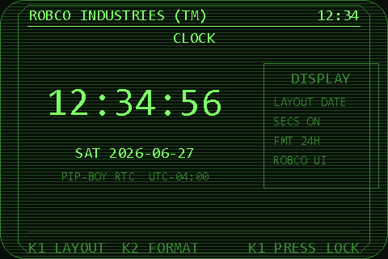
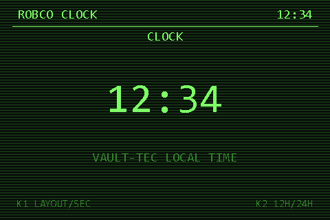
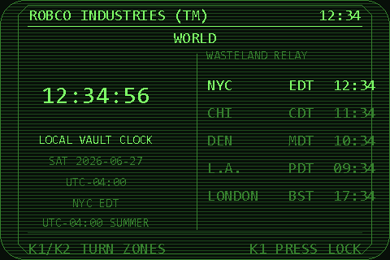
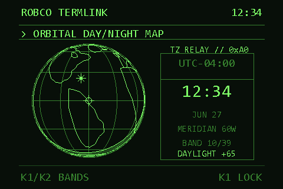
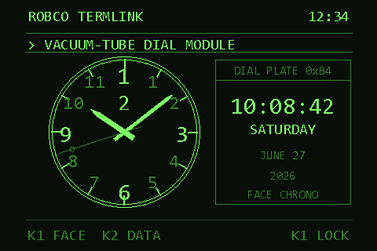
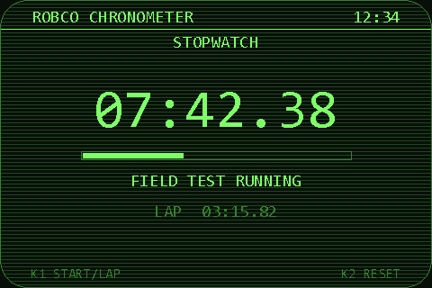
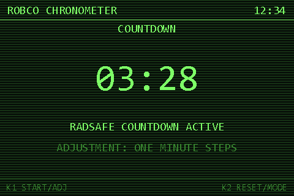
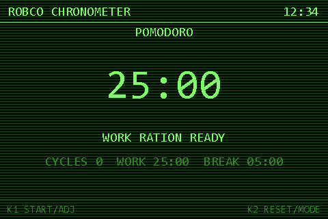
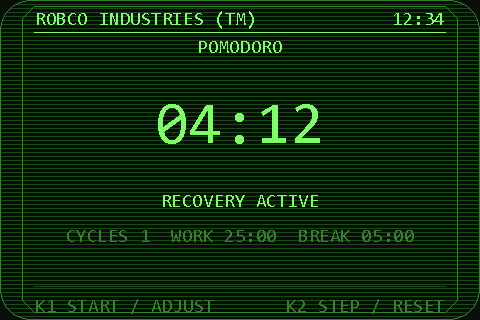

# RobCo Chronometer (Clock Suite)

A full-screen timekeeping suite for the [Wand Company Pip‑Boy](https://thewandcompany.com/pip-boy/)
(an Espruino-based device). Seven modes — a configurable digital clock, a world-clock relay,
a live day/night **globe**, an analog face, a stopwatch, a countdown, and a Pomodoro timer —
all rendered in the Pip‑Boy's 3-level green phosphor aesthetic and driven entirely by the
two physical knobs.

Everything runs on-device in plain ES5 JavaScript with no network access. Time zones, daylight
saving, and the sun's position are all computed locally from the device clock.

```
┌──────────────────────────────────────────────────────────┐
│  CLOCK → WORLD → GLOBE → ANALOG → STOPWATCH → COUNTDOWN →  │
│  POMODORO  (rotate with Knob 2)                            │
└──────────────────────────────────────────────────────────┘
```

---

## Screens

> Previews are rendered at the device's native 480×320 with the scanline/phosphor look.
> They are generated by a companion script (see [Regenerating the previews](#regenerating-the-previews)).

### Clock
A digital clock with four progressively-detailed layouts (`TIME`, `DATE`, `FIELD`, `VAULT`),
selectable 12/24‑hour format, and an optional seconds field. A side rail echoes the current
display settings.




### World
Your local "vault" clock alongside a rolling relay of five world cities. Each row shows the
city, its current zone abbreviation (which flips between standard/summer time automatically,
e.g. `EST`↔`EDT`), and the local time there. The lower-left block details the currently
selected zone's UTC offset and DST state.



### Globe
An orthographic globe centered on the selected city, with coastlines, a lat/long graticule,
the city's time-zone band, and a **live day/night terminator** computed from the real solar
position. The night hemisphere is washed with scanlines, the sub-solar point ("high noon") is
marked, and the side panel reports the selected location's local time plus its solar phase
(`DAYLIGHT` / `TWILIGHT` / `NIGHT`) and the sun's elevation angle.



### Analog
A traditional analog face with hour/minute/second hands, three selectable face styles, and a
"Vault‑Tec certified date" panel that can be toggled on or off.



### Stopwatch
Start/stop with a lap capture. Resolution down to tenths of a second.



### Countdown
A "radsafe" countdown timer adjustable in one-minute steps (1–99 min). Plays a tone on expiry.



### Pomodoro
A work/break cycle timer. Work (5–60 min) and break (1–30 min) lengths are adjustable, cycles
are counted, and the timer auto-advances between phases with an audible cue.




---

## Controls

The whole suite is driven by the two knobs. **Knob 2 is the universal mode dial** — turn it to
cycle through the seven modes. Knob 1 (and a Knob‑2 press) are context-sensitive:

| Mode      | Knob 1 turn            | Knob 1 press        | Knob 2 press        |
|-----------|------------------------|---------------------|---------------------|
| Clock     | Change layout          | Toggle seconds      | Toggle 12/24h       |
| World     | Scroll zones           | —                   | —                   |
| Globe     | Scroll zones           | —                   | —                   |
| Analog    | Change face style      | Toggle date panel   | —                   |
| Stopwatch | Lap (while running)    | Start / stop        | Reset               |
| Countdown | Adjust time (±1 min)   | Start / stop        | Reset               |
| Pomodoro  | Adjust phase (±1 min)  | Start / stop        | Reset               |

> In code the press is delivered as `dir === 0`; a turn is `dir = ±1`. The on-screen footer
> always shows the active bindings (`K1 …` / `K2 …`).

Display preferences (clock layout, seconds, 12/24h, analog face/detail) are persisted to
`USER/CLOCKSUITE.SET` and restored on the next launch.

---

## How it works

The app is a single IIFE in [`APPS/CLOCKSUITE.JS`](APPS/CLOCKSUITE.JS). On load it wires up the
knob handlers via `Pip.on(...)`, restores saved settings, and starts a `setInterval` ticker that
redraws the active mode every **500 ms**. The `draw()` dispatcher routes to one `draw<Mode>()`
per screen; all of them share a common header (title + local time + mode) and footer
(key bindings) plus a small set of vector/mono font and primitive-drawing helpers
(`drawLine`, `drawRect`, `drawCircle`, `drawString`, `setColor` against the 3-level palette).

A few pieces are worth calling out:

- **Daylight saving, computed locally.** Rather than ship a tz database, each zone carries a
  standard offset plus a rule tag (`us`, `eu`, `aus`, `nz`, or `none`). Helpers compute the
  Nth/last-Sunday transition instants for the relevant year and decide whether a given UTC
  instant is in summer time — so abbreviations and offsets stay correct across the year and the
  southern-hemisphere zones wrap correctly across the new year.

- **The globe.** Points are placed with an **oblique orthographic projection** centered on the
  selected city; anything on the far hemisphere is culled. The **day/night terminator** is the
  great circle whose pole is the sub-solar point: the code derives the sub-solar direction from
  an approximate solar declination and the current UTC, expresses it in view space, and traces
  the boundary directly. The night wash solves the terminator conic per scanline. The selected
  location sits at the disc center, so its solar elevation is simply the viewer-facing component
  of the sub-solar vector — that drives the `DAYLIGHT/TWILIGHT/NIGHT` readout.

- **Timers use wall-clock deltas.** The stopwatch, countdown, and Pomodoro store an absolute
  start/end time and recompute remaining/elapsed from `Date.now()` each tick, so they stay
  accurate regardless of redraw jitter.

### Repository layout

| Path | Purpose |
|------|---------|
| [`APPS/CLOCKSUITE.JS`](APPS/CLOCKSUITE.JS) | The application (everything runs from here). |
| [`APPINFO/CLOCK.info`](APPINFO/CLOCK.info) | App-loader manifest (id, name, version, entry point, icon). |
| [`APPINFO/HOLO.IMG`](APPINFO/HOLO.IMG) | App-loader icon referenced by the manifest. |
| [`install.html`](install.html) | Browser-based installer that downloads the current GitHub payload and writes it to a selected microSD card. |
| [`tools/render-clock-suite-previews.ps1`](tools/render-clock-suite-previews.ps1) | PowerShell script that renders the preview PNGs. |
| [`PREVIEWS/`](PREVIEWS/) | Generated screenshots used in this README. |

---

## Installing on a Pip‑Boy

### Browser installer

From a local clone or downloaded copy, open [`install.html`](install.html) in Chrome or Edge,
select the mounted microSD card root, and let it install the files listed in
`APPINFO/CLOCK.info` from the current `main` branch. Eject the device before unplugging it.

### Manual install

1. Connect the Pip‑Boy to your computer (USB / mass-storage, per The Wand Company's
   instructions) so its filesystem is mounted.
2. Copy the app onto the device, preserving the folder layout:
   - `APPS/CLOCKSUITE.JS`
   - `APPINFO/CLOCK.info`
   - `APPINFO/HOLO.IMG`
3. Eject the device and reboot it. **Clock Suite** appears in the app menu; launch it and rotate
   **Knob 2** to move between the seven modes.

No additional libraries or network connection are required — the app uses only the on-device
`Pip` API, the `Graphics` screen object, and `require("fs")` for saving settings.

---

## Development

The app is intentionally dependency-free ES5, so it can be edited with any text editor. The one
constraint to keep in mind: **the globe/UI geometry is implemented twice** — once in the live app
([`APPS/CLOCKSUITE.JS`](APPS/CLOCKSUITE.JS)) and once, by hand, in the preview renderer
([`tools/render-clock-suite-previews.ps1`](tools/render-clock-suite-previews.ps1)). If you change
the projection, shading, or terminator math in the JS, mirror it in the PowerShell script and
regenerate the previews so the docs don't drift.

### Regenerating the previews

The previews are produced on Windows with `System.Drawing` (no device required):

```powershell
# from the repo root
pwsh ./tools/render-clock-suite-previews.ps1
# or with Windows PowerShell:
powershell -ExecutionPolicy Bypass -File ./tools/render-clock-suite-previews.ps1
```

This clears and rewrites `PREVIEWS/*.png` at the native 480×320 resolution.
